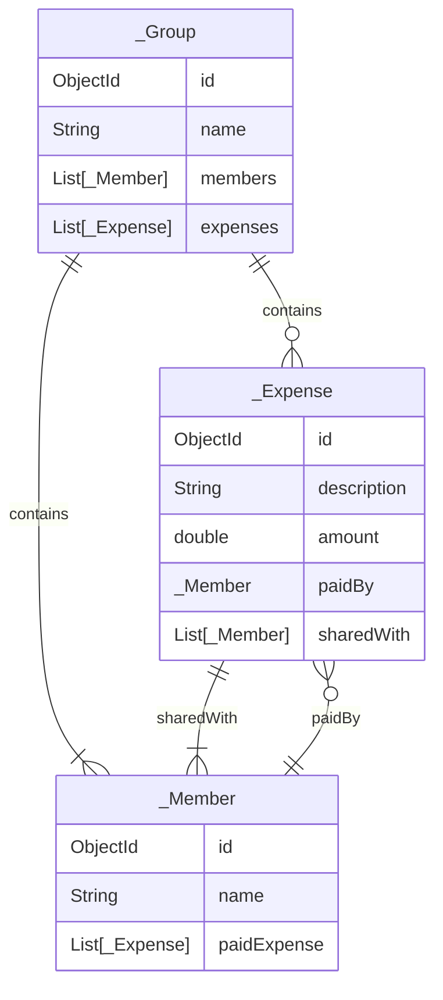

# dango
A Flutter app to easily track and request payment for shared expenses.

# data

```mermaid
  erDiagram
    _Group ||--o{ _Expense : contains
    _Group ||--|{ _Member : contains
    _Group {
        ObjectId id
        String name
        List[_Member] members
        List[_Expense] expenses
    }
    _Expense ||--|{ _Member : sharedWith
    _Expense {
        ObjectId id
        String description
        double amount
        _Member paidBy
        List[_Member] sharedWith
    }
    _Member ||--o{_Expense : paidBy
    _Member {
        ObjectId id
        String name
        List[_Expense] paidExpense
    }
    
```
